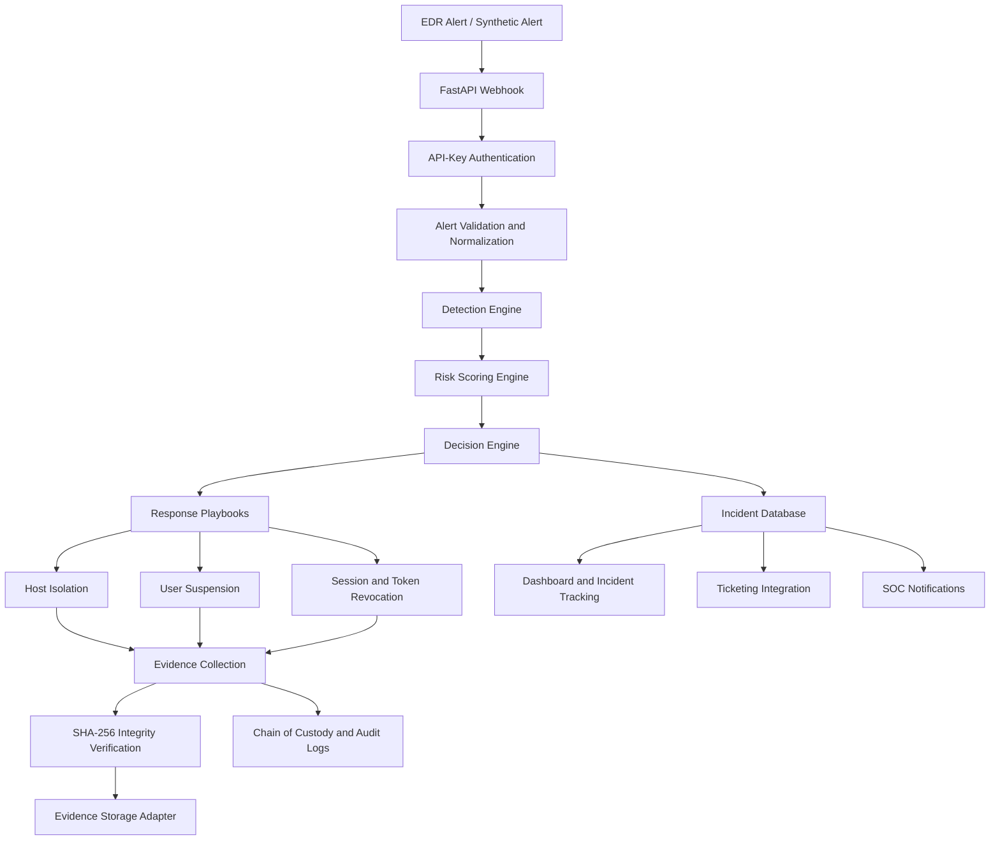

# System Architecture

## Automated Ransomware Containment Orchestrator

This diagram illustrates the intended high-level workflow of the defensive ransomware response platform.

## Main Components

- **FastAPI webhook:** Receives incoming EDR alerts.
- **Authentication and normalization:** Validates requests and converts alerts into the application's internal representation.
- **Detection and risk scoring:** Evaluates suspicious activity and assigns a risk level.
- **Decision engine:** Selects response actions based on the calculated risk.
- **Containment playbooks:** Coordinate host isolation, user suspension, and session/token revocation.
- **Evidence collection:** Collects forensic artifacts and records evidence integrity information.
- **Evidence storage:** Uses the configured storage adapter; local demonstrations can use mock integrations.
- **Database and audit trail:** Track incidents, response actions, evidence, and audit events.
- **Dashboard, ticketing, and notifications:** Support incident visibility and SOC workflows.

## Implementation Note

This is a high-level logical architecture. Exact routes, component connections, and integration behavior should be confirmed against the current source code. Mock integrations do not perform real production containment or external evidence uploads.
